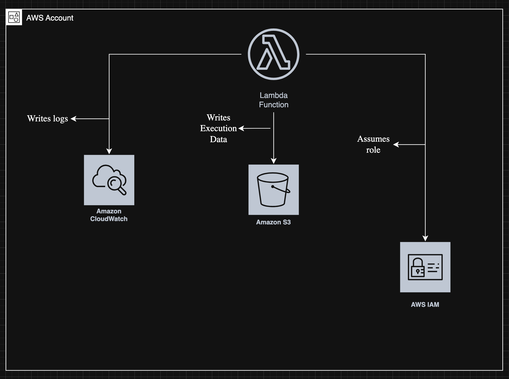

# Task 3: Lambda/Terraform Troubleshooting - FIXED

## Issues Found and Fixed

### Issue 1: S3 Bucket ACL Configuration ❌ → ✅
**Problem**: Using deprecated ACL configuration 
**Error**: `InvalidParameterValue: ACL parameter is no longer supported`  
**Fix**: Removed `aws_s3_bucket_acl` resource - ACLs are disabled by default on new buckets  
**File**: `terraform/main.tf` - ACL resource removed lines 38-39

### Issue 2: Missing Lambda Deployment Package ❌ → ✅
**Problem**: Lambda referenced non-existent `lambda_function_payload.zip` in S3  
**Error**: `InvalidParameterValue: S3 object does not exist`  
**Fix**: 
- Added `archive_file` data source to zip Lambda code
- Added `aws_s3_object` to upload package to S3
**Files**: `terraform/main.tf` lines 72-85

### Issue 3: IAM Role Missing Permissions ❌ → ✅
**Problem**: Lambda role had no policies attached  
**Error**: Lambda couldn't execute or access S3  
**Fix**: 
- Attached `AWSLambdaBasicExecutionRole` for CloudWatch Logs
- Added custom policy for S3 access
**Files**: `terraform/main.tf` lines 89-114

### Issue 4: No CloudWatch Logs Permissions ❌ → ✅
**Problem**: Lambda couldn't write logs for debugging  
**Fix**: Added `AWSLambdaBasicExecutionRole` policy attachment  
**Files**: `terraform/main.tf` lines 117-138

### Issue 5: Non-Unique S3 Bucket Name ❌ → ✅
**Problem**: `my-super-cool-bucket` likely taken globally  
**Fix**: Added random suffix using `random_id` resource  
**Files**: `terraform/main.tf` lines 24-36

### Issue 6: No Source Code Packaging Mechanism ❌ → ✅
**Problem**: No way to automatically package Lambda code  
**Fix**: Used Terraform `archive_file` to create deployment package  
**Files**: `terraform/main.tf` lines 79-86

### Issue 7: Python Runtime Version Outdated ❌ → ✅
**Problem**: `python3.8` approaching end-of-life  
**Fix**: Updated to `python3.12`  
**Files**: `terraform/main.tf` line 146

### Issue 8: Missing Error Handling in Lambda ❌ → ✅
**Problem**: Lambda had no try-catch, couldn't diagnose failures  
**Fix**: Added comprehensive error handling and logging  
**Files**: `lambda/handler.py` entire file

### Issue 9: Lambda Not Using S3 Bucket ❌ → ✅
**Problem**: Lambda didn't actually interact with S3  
**Fix**: Enhanced Lambda to write execution data to S3  
**Files**: `lambda/handler.py` lines 29-36

### Issue 10: Missing Dependency Management ❌ → ✅
**Problem**: Terraform might create Lambda before IAM policies attached  
**Fix**: Added explicit `depends_on` to Lambda resource  
**Files**: `terraform/main.tf` lines 117-138

---

## Prerequisites

- AWS CLI configured (`aws configure`)
- Terraform >= 1.0
- Python 3.12
- AWS Account with permissions to create:
  - S3 buckets
  - Lambda functions
  - IAM roles
  - CloudWatch Logs

---

## Project Structure
```
task3/
├── terraform/
│   ├── main.tf              # Fixed Terraform configuration
│   ├── variables.tf         # Input variables
│   ├── outputs.tf           # Output values
│   └── README.md            # This file
├── lambda/
│   ├── handler.py           # Fixed Lambda function with error handling
│   └── requirements.txt     # Python dependencies
└── FIXES.md                 # Detailed changelog
└── README.md                # Original README
```

---

## Deployment Instructions

### Step 1: Navigate to Terraform Directory
```bash
cd devops-aws-lambda-troubleshooting-files/terraform
```

### Step 2: Initialize Terraform
```bash
terraform init
```

### Step 3: Validate Configuration
```bash
terraform validate
```

### Step 4: Preview Changes
```bash
terraform plan
```

**Review the plan** - should show creation of:
- 1 Random ID
- 1 S3 Bucket
- 1 S3 Bucket Versioning
- 1 S3 Bucket Public Access Block
- 1 S3 Bucket Server-Side Encryption
- 1 S3 Object (Lambda package)
- 1 IAM Role
- 1 IAM Role Policy Attachment
- 1 IAM Role Policy
- 1 Lambda Function
- 1 CloudWatch Log Group

**Total: ~11 resources**

### Step 5: Apply Configuration
```bash
terraform apply
```

Type `yes` when prompted.

**Expected Output:**
```
Apply complete! Resources: 11 added, 0 changed, 0 destroyed.

Outputs:

lambda_function_arn = "arn:aws:lambda:us-west-2:123456789012:function:spintech-lambda"
lambda_function_name = "spintech-lambda"
lambda_invoke_command = "aws lambda invoke --function-name spintech-lambda --region us-west-2 --payload '{}' response.json"
s3_bucket_name = "lambda-deployment-a1b2c3d4e5f6g7h8"
```

---

## Testing the Lambda Function

### Method 1: Using AWS CLI (Recommended)
```bash
# Use the command from Terraform output
aws lambda invoke \
  --function-name spintech-lambda \
  --region us-west-2 \
  --payload '{}' \
  response.json

# View response
cat response.json
```

**Expected Response:**
```json
{
  "statusCode": 200,
  "body": "{\n  \"message\": \"Success!\",\n  \"data\": {\n    \"message\": \"Hello from Lambda!\",\n    \"timestamp\": \"2025-11-27T10:30:00.123456\",\n    \"event\": {},\n    \"bucket\": \"lambda-deployment-a1b2c3d4e5f6g7h8\"\n  },\n  \"s3_location\": \"s3://lambda-deployment-a1b2c3d4e5f6g7h8/lambda-executions/2025-11-27/10-30-00.json\"\n}",
  "headers": {
    "Content-Type": "application/json"
  }
}
```

### Method 2: Check CloudWatch Logs
```bash
# Get recent log events
aws logs tail /aws/lambda/spintech-lambda --follow
```

**Expected Output:**
```
2025-11-27T10:30:00.123 Successfully wrote data to s3://lambda-deployment-xxx/lambda-executions/2025-11-27/10-30-00.json
```

### Method 3: Verify S3 Uploads
```bash
# List objects in bucket (use bucket name from Terraform output)
BUCKET_NAME=$(terraform output -raw s3_bucket_name)
aws s3 ls s3://$BUCKET_NAME/lambda-executions/ --recursive
```

**Expected Output:**
```
2025-11-27 10:30:00        256 lambda-executions/2025-11-27/10-30-00.json
```

### Method 4: Test via AWS Console

1. Go to **AWS Console → Lambda**
2. Find function `spintech-lambda`
3. Click **Test** tab
4. Create new test event (default template is fine)
5. Click **Test**
6. Should see success message

---

## Verification Checklist

- [ ] `terraform init` succeeds
- [ ] `terraform validate` passes
- [ ] `terraform plan` shows ~11 resources
- [ ] `terraform apply` completes without errors
- [ ] Lambda function exists in AWS Console
- [ ] Lambda invocation returns HTTP 200
- [ ] S3 bucket contains execution logs
- [ ] CloudWatch Logs show successful execution
- [ ] No error messages in logs

---

## Cleanup - To Avoid Charges
```bash
# Destroy all resources
terraform destroy

# Confirm by typing 'yes'
```
---

## Simple Architecture Diagram

```
┌─────────────────────────────────────────────────┐
│                  AWS Account                     │
│                                                  │
│  ┌────────────────────────────────────────────┐ │
│  │         Lambda Function                     │ │
│  │  - Runtime: Python 3.12                    │ │
│  │  - Handler: handler.handler                │ │
│  │  - Memory: 128 MB                          │ │
│  │  - Timeout: 30s                            │ │
│  └───────────┬────────────────────────────────┘ │
│              │                                   │
│              │ writes logs                       │
│              ▼                                   │
│  ┌────────────────────────────────────────────┐ │
│  │      CloudWatch Logs                       │ │
│  │  /aws/lambda/spintech-lambda              │ │
│  │  - Retention: 7 days                       │ │
│  └────────────────────────────────────────────┘ │
│              │                                   │
│              │ writes execution data             │
│              ▼                                   │
│  ┌────────────────────────────────────────────┐ │
│  │         S3 Bucket                          │ │
│  │  lambda-deployment-[random]                │ │
│  │  ├── lambda_function_payload.zip           │ │
│  │  └── lambda-executions/                    │ │
│  │      └── 2025-11-27/                       │ │
│  │          └── 10-30-00.json                 │ │
│  └────────────────────────────────────────────┘ │
│              ▲                                   │
│              │ reads deployment package          │
│              │                                   │
│  ┌────────────────────────────────────────────┐ │
│  │         IAM Role                           │ │
│  │  - Lambda Execution Role                   │ │
│  │  - Policies:                               │ │
│  │    • AWSLambdaBasicExecutionRole           │ │
│  │    • S3 Read/Write Access                  │ │
│  └────────────────────────────────────────────┘ │
│                                                  │
└─────────────────────────────────────────────────┘
```

---

## Design Decisions

### Why Python 3.12?
- More stable runtime
- Better performance than 3.8
- Long-term AWS support

### Why Random Bucket Suffix?
- Ensures global uniqueness
- Prevents deployment failures
- Allows multiple environments

### Why Explicit Dependencies?
- Prevents race conditions
- Ensures proper resource creation order
- More predictable behavior

### Why Remove ACL Configuration?
- ACLs are disabled by default on new S3 buckets
- Modern AWS best practice uses bucket policies instead
- Simplifies configuration and follows AWS recommendations

---

## Author

**Iniemem Udosen**  
DevOps Engineer  
iniememudosen@gmail.com
